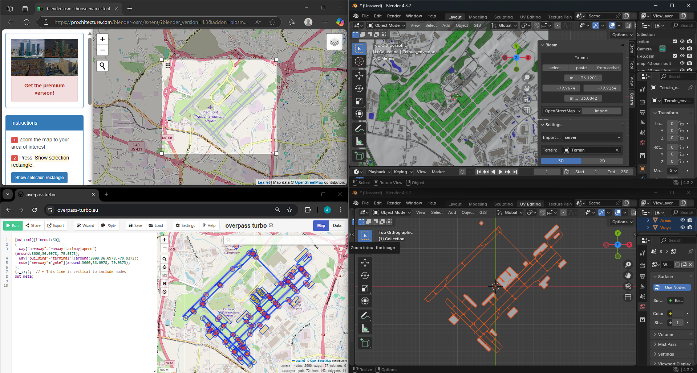
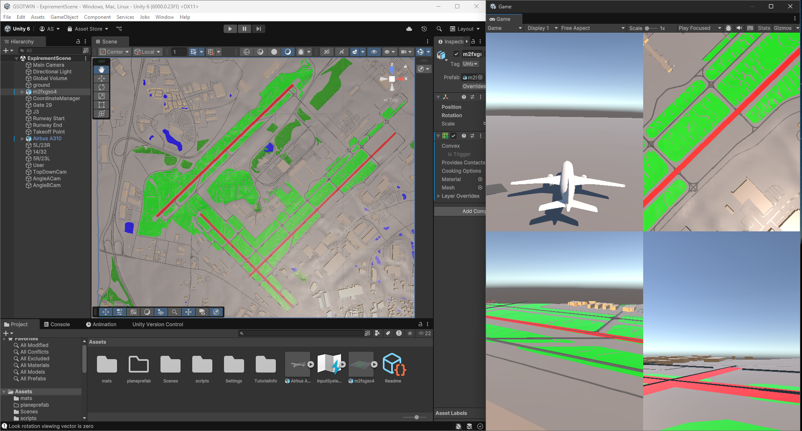

# ATC_3D
# ✈️ 3D Digital Twin of GSO Airport in Unity: First Phase Development and Future Vision

---

## 📋 Project Overview

This project represents the first phase in exploring the creation of a 3D digital twin of Greensboro's Piedmont Triad International Airport (GSO) using Unity.
The purpose is to establish a foundation for future research into predictive maintenance, incident prevention, AI-based monitoring, and simulation-driven airport planning.

This phase includes:
- Importing real-world geographic data
- Modeling the airport in Blender and Unity
- Aircraft movement across placed waypoints
- Setting up multi-camera monitoring systems

---

## 🛠 Tools, Versions, and Resources Used

| Tool / Software            | Version          | Purpose                                          | Link |
|-----------------------------|------------------|--------------------------------------------------|------|
| **Blender**                 | 4.0              | 3D modeling of airport, runways, taxiways        | [Blender.org](https://www.blender.org/) |
| **BlenderGIS Addon**        | 2.1.9            | Importing geospatial OSM data                    | [BlenderGIS GitHub](https://github.com/domlysz/BlenderGIS) |
| **Blosm Addon (Blender)**   | 2.4.0            | OpenStreetMap terrain import                    | [Blosm Documentation](https://github.com/vvoovv/blosm) |
| **Overpass Turbo**          | Web              | OSM data extraction and queries                 | [Overpass Turbo](https://overpass-turbo.eu/) |
| **Unity**                   | 2022.3 LTS       | Real-time simulation and scene setup            | [Unity](https://unity.com/) |
| **Visual Studio Code**      | 1.88.1           | C# script editing for Unity                     | [VS Code](https://code.visualstudio.com/) |
| **Free3D (Model Source)**   | Web              | Aircraft model download                         | [Free3D](https://free3d.com/) |
| **OpenStreetMap (OSM)**     | Public Dataset   | Real-world airport mapping data                 | [OpenStreetMap](https://www.openstreetmap.org/) |

## Links to Tutorials 

Blosm - https://www.youtube.com/watch?v=Thx08Q4etVc
BlenderGIS - https://www.youtube.com/watch?v=h-ALdlxfygI&t=919s


---

## 🗂️ Repository Structure

```
/data/                - Raw OSM files and aircraft movement logs
/scripts/             - Aircraft waypoint movement scripts (C#)
/unity-project/       - Complete Unity scene and assets
/blender-models/      - Blender files for airport terrain and structures
PlaneController.cs    - Controls aircraft taxiing, runway roll, and takeoff
README.md             - Project overview (this file)
```

---

## 📚 Datasets Used

- **OpenStreetMap (OSM)** data extracted via **Overpass Turbo**
- Coverage area: 36.05°N, -79.97°W to 36.12°N, -79.92°W

**Example Query:**
```sql
[out:xml][timeout:50];
(
  way["aeroway"~"runway|taxiway|apron"](around:3000,36.0978,-79.9373);
  way["building"="terminal"](around:3000,36.0978,-79.9373);
  node["aeroway"="gate"](around:3000,36.0978,-79.9373);
);
(._;>;);  // ← This line is critical to include nodes
out meta;

```

---

## ⚙️ Setup Instructions

1. Install Unity 2022.3 LTS.
2. Clone or download this repository.
3. Open `/unity-project/` inside Unity Editor.
4. Open the main scene to view and simulate.
5. (Optional) Install Blender 4.0 if modifications to 3D models are needed.
6. (Optional) Install Python 3.8+ if preprocessing data is necessary.

---

## 🛠️ Aircraft Movement System

- Aircraft currently follows a sequence of manually placed **waypoints**:
  - (Gate → Taxiway → Runway Start → Runway End → Takeoff Point)
- Smooth rotation and acceleration behavior scripted.

**Future Enhancement:**
- Allow users to input **real-world GPS coordinates** directly.
- Automatic path generation based on entered coordinates.

---

## 🔍 Expected Output and Verification

- Aircraft taxis and lifts off based on waypoint paths.
- Four simultaneous camera views: Top-Down, Side View, Plane-Follow, Ground Level.
- Stable scene rendering without flickering or object misalignment.

---

## 📷 Visuals

**Blender Data Import + OSM Layout:**


**Unity Scene Setup + Simulation View:**


---

## 🔮 Future Use and Research Directions

- Real-time incident detection and AI-based conflict prediction.
- Timeline reconstruction for event replay and forensic review.
- Predictive taxi routing and gate assignment optimization.
- Dataset generation for ML-based airport operation models.
- Integration of Vision-Language Models (VLLMs) for scene understanding.
- Full dynamic air traffic control (ATC) simulation.

---

# 🚀 This is only the beginning: evolving toward a predictive, AI-augmented digital twin of airport operations.
